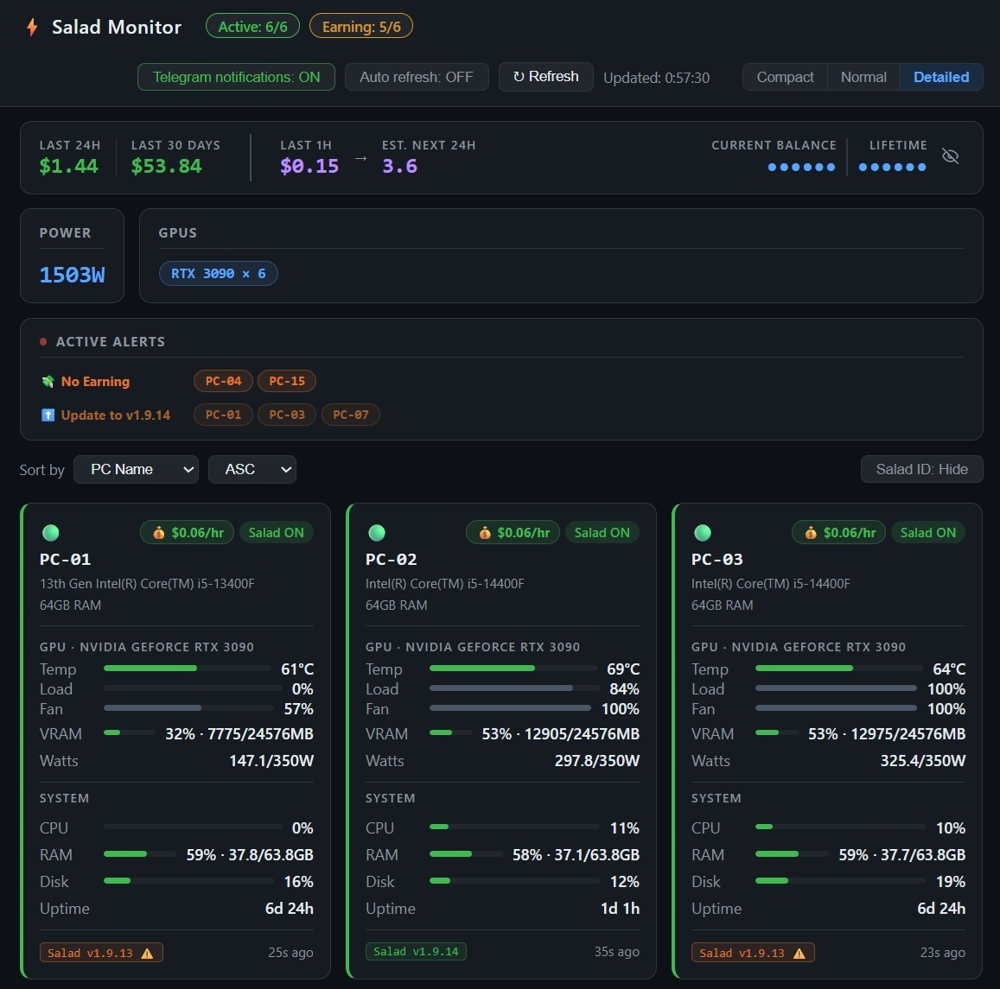
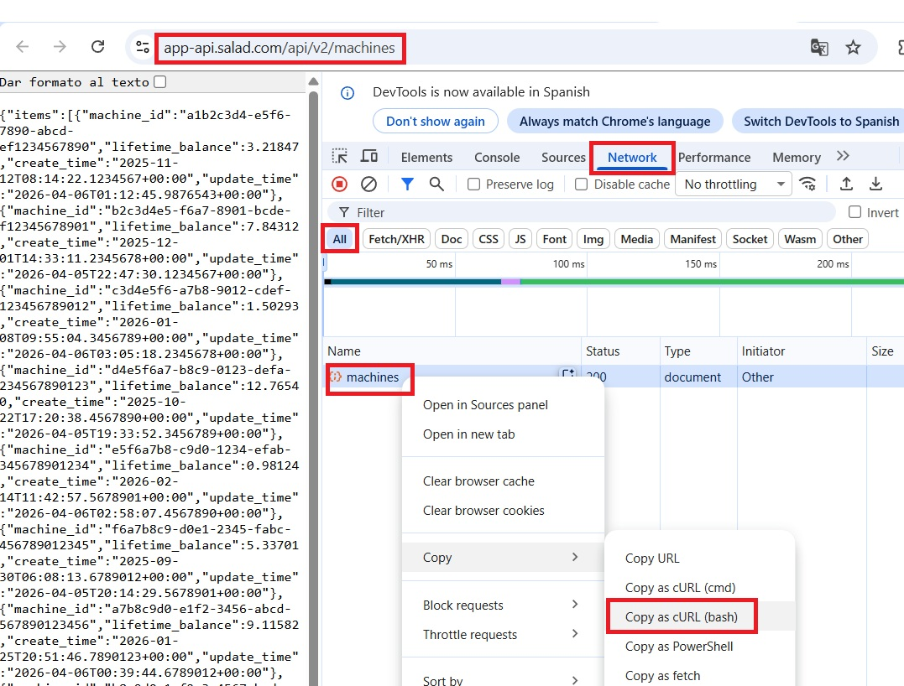

# Salad Monitor

A monitoring dashboard for multiple PCs running the [Salad](https://salad.com) GPU computing platform. Each PC runs a lightweight agent that reports metrics to a central server, which displays them in a web dashboard and sends Telegram notifications.



---

## Requirements

- **Agent PCs:** Windows with NVIDIA GPU and NVIDIA drivers installed (nvidia-smi required). No Python needed.
- **Server PC:** Python 3.10+

---

## 1. Setting up the Agents

Each PC you want to monitor needs the `agent/` folder.

**1.1 Copy the agent folder** to the PC.

**1.2 Edit `salad_agent_config.json`:**

```json
{
  "machine_id": "PC-01",
  "server_url": "http://192.168.1.100:5000",
  "api_key": "your_api_key_here",
  "interval_seconds": 60,
  "salad_machine_id": ""
}
```

| Field | Description |
|---|---|
| `machine_id` | A unique name for this PC (e.g. `PC-01`, `PC-LAB-03`) |
| `server_url` | IP and port of the server PC |
| `api_key` | Create your own random api key. Must match the `api_key` in the server's `config.json` |
| `interval_seconds` | How often to send metrics (60 recommended) |
| `salad_machine_id` | Leave empty — the agent will find and save it automatically when the agent starts. If it can't be found get the full id from here https://app-api.salad.com/api/v2/machines |

**1.3 Run the agent:**

Double-click `salad_agent.bat` to start it manually

---

## 2. Setting up the Server

The server receives metrics from all agents and serves the web dashboard.

**2.1 Install Python 3.10+** (if not already installed):

```
winget install Python.Python.3.12
```

**2.2 Copy the `server/` folder** to the PC that will act as the server.

**2.2 Edit `server/config.json`:**

```json
{
  "server": {
    "port": 5000,
    "api_key": "your_api_key_here"
  },
  "expected_machines": {},
  "telegram": {
    "token": "",
    "chat_id": "",
    "report_interval_minutes": 15,
    "stale_threshold_minutes": 5,
    "notifications_enabled": true
  },
  "salad_api": {
    "auth_cookie": "",
    "cf_clearance": ""
  }
}
```

- Set `api_key` to any random string. Use the same value in all agents.
- `expected_machines` can be left empty — machines register automatically when they first report in.

**2.3 Start the server:**

Double-click `run_server.bat`. Dependencies are installed automatically on first run.

**2.4 Open the dashboard:**

```
http://localhost:5000/dashboard
```

Or from another PC on the same network:

```
http://<server-ip>:5000/dashboard
```

---

## 3. Getting the Salad Cookies

The server uses your Salad session cookies to fetch earnings data from the Salad API. These cookies need to be updated periodically when they expire.

> ⚠️ **Warning:** Do not share these values with anyone. The credentials will be saved in `config.json` — do not share that file either.

**3.1 Run `update_credentials.bat`** 

**3.2 Follow the on-screen instructions:**

1. Make sure you are logged in to Salad in Chrome first.
2. Navigate to `https://app-api.salad.com/api/v2/machines`
3. Press F12, go to the Network tab, and reload the page (F5).
4. Right-click the request → Copy → Copy as cURL (bash)



5. Paste the result into the terminal and press Enter.

The script will extract and save the credentials to `config.json` automatically.

> **Note:** Restart the server after updating the credentials for the changes to take effect.

---

## 4. Setting up Telegram Notifications

The server can send a periodic status report to a Telegram chat.

**4.1 Create a Telegram bot:**

1. Open Telegram and search for `@BotFather`
2. Send `/newbot` and follow the steps
3. Copy the bot token (looks like `123456789:AAF...`)

**4.2 Get your chat ID:**

1. Send any message to your bot
2. Open `https://api.telegram.org/bot<YOUR_TOKEN>/getUpdates` in a browser
3. Find `"chat": {"id": ...}` in the response — that is your chat ID

**4.3 Edit `server/config.json`:**

```json
"telegram": {
  "token": "123456789:AAFxxxxxxx",
  "chat_id": "123456789",
  "report_interval_minutes": 15,
  "stale_threshold_minutes": 5,
  "notifications_enabled": true
}
```

| Field | Description |
|---|---|
| `token` | Bot token from BotFather |
| `chat_id` | Your Telegram chat ID |
| `report_interval_minutes` | How often to send the report |
| `stale_threshold_minutes` | Minutes before a machine is considered offline |
| `notifications_enabled` | Can also be toggled from the dashboard |

Restart the server after editing. You can also toggle notifications on/off from the dashboard without restarting.
